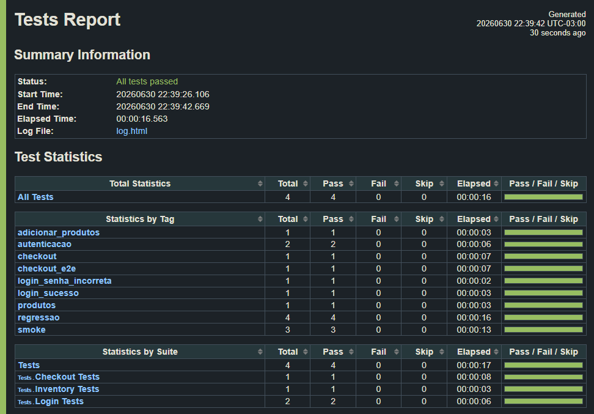

# 🧪 Sauce Demo - E2E Web Automation

<p align="center">
  
  
  
  
</p>

Projeto de automação de testes End-to-End (E2E) desenvolvido com foco em **boas práticas de engenharia de software** e **escalabilidade**. O objetivo é simular a jornada de compra de um usuário no e-commerce **Sauce Demo**, utilizando **Robot Framework** com **Playwright**.

---

## 📸 Evidências de Execução

Aqui está o resultado visual da suíte de testes integrada executada com sucesso através do relatório nativo gerado pelo framework:

<p align="center">
  
</p>

---

## 🏗️ Arquitetura e Padrões de Projeto

O projeto foi estruturado seguindo o modelo **Page Object Pattern**, separando rigorosamente as responsabilidades do código para garantir escalabilidade e fácil manutenção:

*   **`config/`**: Isolamento de variáveis globais e configurações de infraestrutura de ambiente.
*   **`data/`**: Gerenciamento de massa de dados através do padrão *Data-Driven Testing* em arquivos externos JSON.
*   **`resources/elements/`**: Mapeamento técnico de localizadores da interface (IDs e seletores CSS) isolados em arquivos Python.
*   **`resources/pages/`**: Camada de encapsulamento de ações de negócio (*Keywords*) utilizando comandos modernos da Browser Library.
*   **`tests/`**: Cenários de testes descritivos focados no comportamento do usuário, livres de implementações técnicas.

### 📁 Árvore de Diretórios

```text
robotframework-web-tests/
├── assets/
├── config/
│   └── env_dev.py
├── data/
│   └── massa_usuarios.json
├── resources/
│   ├── base.resource
│   ├── elements/
│   │   ├── checkout_elements.py
│   │   ├── inventory_elements.py
│   │   └── login_elements.py
│   └── pages/
│       ├── checkout_page.resource
│       ├── inventory_page.resource
│       └── login_page.resource
└── tests/
    ├── checkout_tests.robot
    ├── inventory_tests.robot
    └── login_tests.robot
```

---

## 🎯 Cenários de Teste Cobertos

### 🔐 Autenticação (Login)
*   **Cenário Positivo**: Login realizado com sucesso consumindo credenciais dinâmicas do JSON.
*   **Cenário Negativo**: Validação de mensagem de erro ao submeter credenciais inválidas.

### 🛍️ Vitrine de Produtos (Inventory)
*   **Cenário Positivo**: Adição de múltiplos produtos simultâneos e validação em tempo real do contador do carrinho.

### 💳 Compra de Ponta a Ponta (Checkout E2E)
*   **Cenário Positivo (E2E)**: Jornada completa do usuário abrangendo autenticação, seleção de itens, abertura de carrinho, preenchimento de formulário de entrega e validação de tela final de sucesso.

---

## 🛠️ Pré-requisitos e Instalação

Certifique-se de ter o **Python 3.13+** e o **Node.js** instalados na sua máquina.

1. Instale as dependências listadas no projeto:
   ```bash
   pip install -r requirements.txt
   ```

2. Inicialize os binários dos navegadores nativos do Playwright:
   ```bash
   rfbrowser init
   ```

---

## 🚀 Execução dos Testes

Os testes contam com uma estratégia de **Tags Personalizadas** para permitir execuções parciais e inteligentes.

*   Executar **todos** os testes do projeto de uma vez só:
    ```bash
    robot -d logs tests/
    ```

*   Executar apenas a suíte de **Regressão**:
    ```bash
    robot -d logs --include regressao tests/
    ```

*   Executar apenas os cenários vitais (**Smoke Tests**):
    ```bash
    robot -d logs --include smoke tests/
    ```

*   Executar um cenário exclusivo (Ex: fluxo de checkout):
    ```bash
    robot -d logs --include checkout_e2e tests/
    ```

---

## 📊 Relatórios de Execução
Ao término de cada execução, o framework gera relatórios interativos e ricos visualmente dentro do diretório `/logs`. Abra o arquivo `report.html` ou `log.html` em qualquer navegador para auditar os resultados e conferir os prints capturados automaticamente nas telas pelas regras do `Teardown`.
